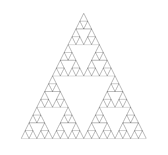
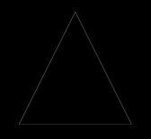

Sierpinski's Triangle: https://en.wikipedia.org/wiki/Sierpinski_triangle







1) Make a directory

2) cd into it

3) clone:
```git clone https://github.com/patrickstocklin/sierpinski-fractal-triangle```

4) Paste Sierpinski.html's path into your preferred web browser

5) Fractals!


You can change the number of recursive calls by opening up Sierpinski into and editing var numOfIterations within initVertexBuffers(gl).

Will add a polished explanation and an animated sequence later...

Edited: Now includes animation through iterations of recursive draw function.
